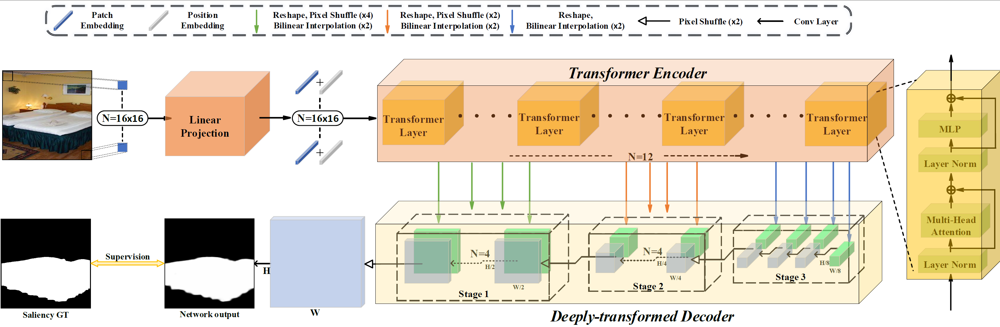

# GLSTR (Global-Local Saliency Transformer)
This is the official implementation of paper ["Unifying Global-Local Representations in Salient Object Detection with Transformer"](https://arxiv.org/abs/2108.02759) by Sucheng Ren, Qiang Wen, Nanxuan Zhao, Guoqiang Han, Shengfeng He

## Prerequisites
The whole training process can be done on eight RTX2080Ti or four RTX3090.
+ Pytorch 1.6

## Datasets
### Training Set
We use the training set of [DUTS](http://saliencydetection.net/duts/) (DUTS-TR) to train our model. 
````
/path/to/DUTS-TR/
   img/
      img1.jpg
   label/
      label1.png
````
### Testing Set
We test our model on the testing set of [DUTS](http://saliencydetection.net/duts/), [ECSSD](https://www.cse.cuhk.edu.hk/leojia/projects/hsaliency/dataset.html), [HKU-IS](https://i.cs.hku.hk/~yzyu/research/deep_saliency.html), [PASCAL-S](http://cbi.gatech.edu/salobj/), [DUT-OMRON](http://saliencydetection.net/dut-omron/), and [SOD](https://www.elderlab.yorku.ca/resources/salient-objects-dataset-sod/) to test our model.

## Training
Download the pretrained transformer [backbone](https://dl.fbaipublicfiles.com/deit/deit_base_distilled_patch16_384-d0272ac0.pth) on ImageNet. 
```
# input the path to training data and pretrained backbone in train.sh
bash train.sh
```

## Testing
Download the pretrained model from [Baidu pan](https://pan.baidu.com/s/18Lnkk1ldZUQSa5EtjSvNqQ)(code: uo0a), [Google drive](https://drive.google.com/drive/folders/1UwjuRdb5Vd7rzzeL6WTlCd7VHSBLU0lP?usp=sharing), and put it int ./ckpt/
```
python test.py
```
## Evaluation
The precomputed saliency maps (DUTS-TE, ECSSD, HKU-IS, PASCAL-S, DUT-OMRON, and SOD) can be found at [Baidu pan](https://pan.baidu.com/s/18Lnkk1ldZUQSa5EtjSvNqQ)(code: uo0a), [Google drive](https://drive.google.com/drive/folders/1UwjuRdb5Vd7rzzeL6WTlCd7VHSBLU0lP?usp=sharing).

After paper submission, we retrain the model, and the performance is improved. Feel free to use the results of our paper or the precomputed saliency maps.
## Contact
If you have any questions, feel free to email Sucheng Ren :) (oliverrensu@gmail.com) 

## Citation
Please cite our paper if you think the code and paper are helpful.
```
@article{ren2021unifying,
  title={Unifying Global-Local Representations in Salient Object Detection with Transformer},
  author={Ren, Sucheng and Wen, Qiang and Zhao, Nanxuan and Han, Guoqiang and He, Shengfeng},
  journal={arXiv preprint arXiv:2108.02759},
  year={2021}
}
```

